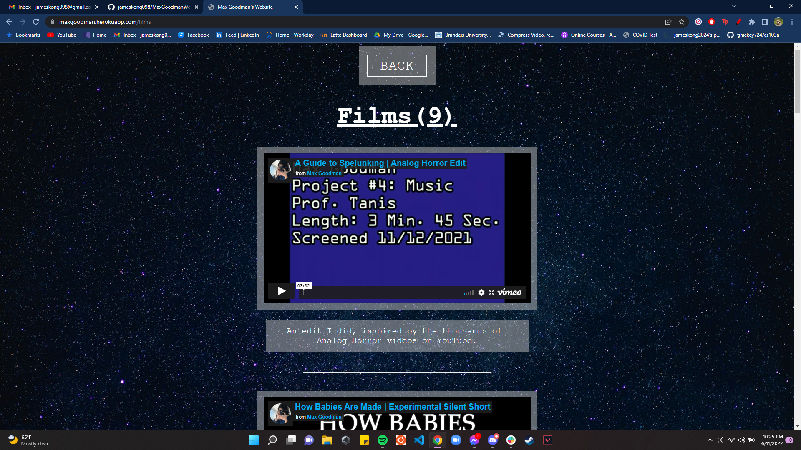
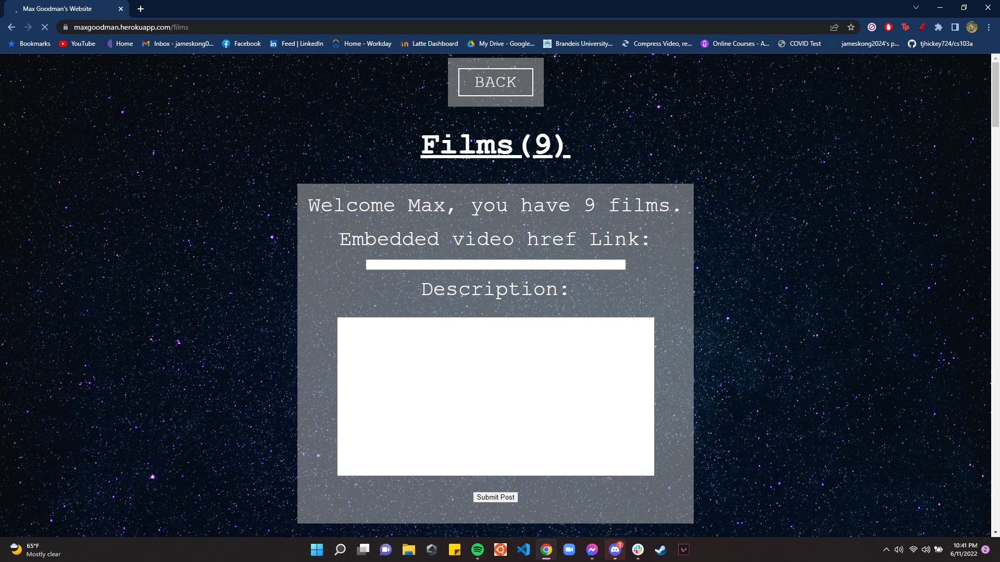
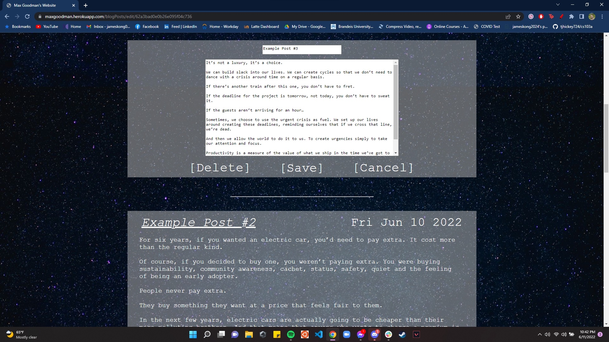
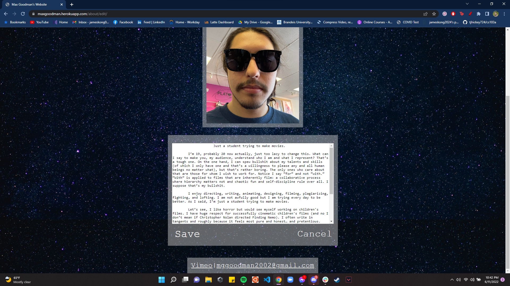
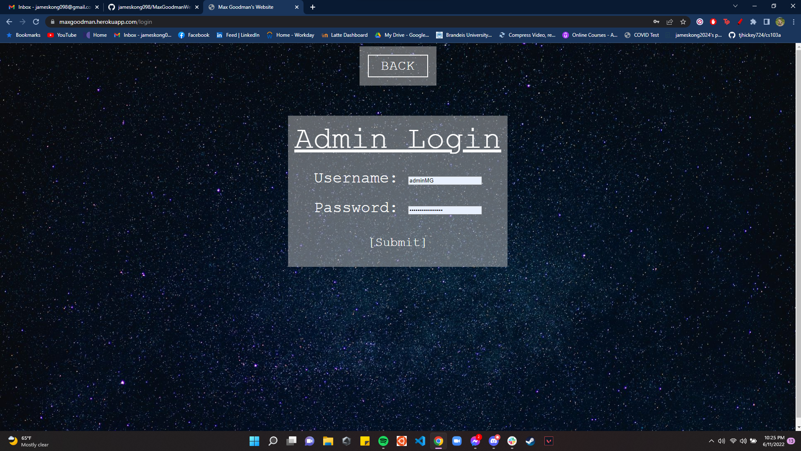

# Movie Portfolio Website

This repository contains the source code for a website created for a friend of mine. The website serves as a practice project to enhance my skills in HTML, JavaScript, Express.js, and Node.js. It showcases his movies, animations, blog posts, and personal information about him. It contains an authentication login system for him to go in and add/edit posts by himself.








## Features

- **Authentication**: Admin account which can log in and add/edit posts.
- **Dynamic Content**: The website uses EJS templates to render dynamic content.
- **Database Integration**: The application connects to a MongoDB database to store and retrieve data.
- **Responsive Design**: The website is designed to be responsive and works well on different screen sizes.

## Live Website

(Website is now down and is no longer in use, but it was hosted on Heroku!)

~~You can view the live website at: [https://maxgoodman.herokuapp.com/index](https://maxgoodman.herokuapp.com/index)~~

### Key Files and Directories

- **app.js**: The main entry point of the application. It sets up the Express server, connects to the MongoDB database, and configures session handling and routing.
- **models/**: Contains Mongoose models for different entities such as `About`, `Animation`, `Film`, `Post`, and `User`.
- **public/**: Contains static files such as images and stylesheets.
  - **stylesheets/style.css**: The main stylesheet for the website.
- **routes/**: Contains route handlers for different parts of the application.
  - **auth.js**: Handles authentication routes such as login, register, and logout.
- **views/**: Contains EJS templates for rendering different pages of the website.
  - **about.ejs**: Template for the "About" page.
  - **aboutDeveloper.ejs**: Template for the "About the Developer" page.
  - **animations.ejs**: Template for the "Animations" page.
  - **blogPosts.ejs**: Template for the "Blog Posts" page.
  - **error.ejs**: Template for the error page.
  - **films.ejs**: Template for the "Films" page.
  - **index.ejs**: Template for the home page.
  - **login.ejs**: Template for the login page.

## Setup and Installation

1. Clone the repository:
    ```sh
    git clone https://github.com/jameskong098/MaxGoodmanWebsite.git
    cd MaxGoodmanWebsite
    ```

2. Install dependencies:
    ```sh
    npm install
    ```

3. Start local mongodb server (optional)
    ```sh
    mongodb
    ```

4. Set up environment variables:
    Create a `.env` file in the root directory and add the following:
    ```env
    mongodb_URI=your_mongodb_uri
    userID=your_user_id
    SECRET=your_secret_key
    ```

5. Run the application:
    ```sh
    npm start
    ```
